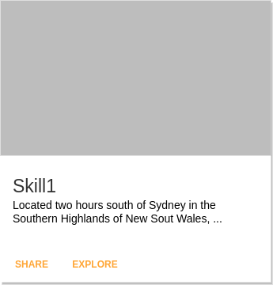

# My engineering web site overview

- [My engineering web site overview](#my-engineering-web-site-overview)
  - [Page Design](#page-design)
    - [Pages](#pages)
      - [Top page](#top-page)
      - [Profile Page](#profile-page)
      - [Experiences page](#experiences-page)
      - [Contact](#contact)
    - [Implementation with Angular](#implementation-with-angular)
      - [Comopnents](#comopnents)
        - [top](#top)
        - [profile](#profile)
        - [experiences-container](#experiences-container)
        - [experiences-head](#experiences-head)
        - [experiences-content](#experiences-content)
        - [experience-card](#experience-card)
        - [contact](#contact-1)
      - [Services](#services)
        - [experiences-api](#experiences-api)

## Page Design


Contact page is under construction.

### Pages

#### Top page

Simply explains what I am and what I can.

#### Profile Page

#### Experiences page

Display the demo applications in tiles.
By clicking each tiles, it jumps to the applications to explain my work.

Skills tiled with material UI cards.
Jumps to the site of the implementation using the skill.


| element     | description                                                  |
| :---------- | :----------------------------------------------------------- |
| PNG file    | The top Web Site screen shot.(also has the link to the site) |
| SKILL Name  | Skill name listed in DB.                                     |
| Description | Skill Description in DB                                      |
| Share       | For visitors to share the skill card in Linkdin              |
| Exlore      | Link to the Web Site                                         |

#### Contact

### Implementation with Angular

```sh
ng new pome
ng generate component top
ng generate component profile
ng generate component experiences-head
ng generate component experiences-container
ng generate component experiences-content
ng generate component experience-card
ng generate component contact

ng generate service experiences-api
```

#### Comopnents

##### top

Component to display the top hero page.
##### profile

Component to display my overall profile.
##### experiences-container

Experince container to discplay the experiences.
This includes head, content section.
Cards are included in the content section
##### experiences-head

Compoment to provide the list of skills category at the header of the experiences section.
##### experiences-content

holds the
##### experience-card

##### contact

TBD
#### Services

##### experiences-api

The service to extract my skills card entry from the backend API server.
Following is the table structure.


